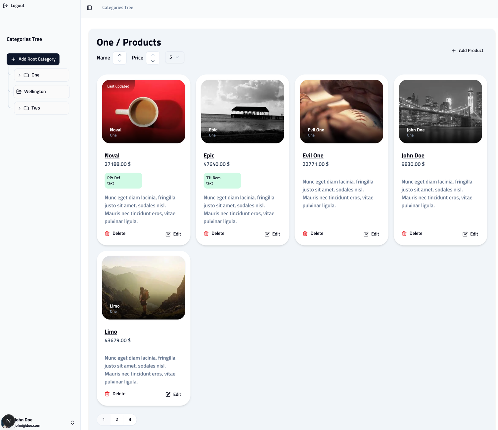

# Pruduct CRUD

[demo](https://h24-bxp.vercel.app/)

## Before you begin
 - This is a Next.js 15 TypeScript project using a PostgreSQL database and Better Auth.
 - You must run PostgreSQL locally, remotely (e.g., https://neon.tech/), or in Docker.
 - Configure your environment variables with your database and Better Auth secret.

## Environment Configuration

You can rename and use the example.env file as your Next.js local.env. The minimum required environment variables are:

1) DATABASE_URL // PS DB Connection url
2) BETTER_AUTH_SECRET -> https://www.better-auth.com/docs/installation#set-environment-variables
3) BETTER_AUTH_URL // Your site base url

## Database Migration

Once your database is set up, migrate before starting the project.

Install dependencies:

```bash
yarn install
```

Generate migration (optional):

```bash
yarn db:gen
```

Run migration:

```bash
yarn db:mig
```

(Optional) Launch Drizzle Studio:

```bash
yarn db:sdt

```
https://orm.drizzle.team/

## Development

Start the development server:

```bash
yarn dev
```


## Testing

Run tests:

```bash
yarn test
```

Run tests with coverage:

```
yarn test:coverage
```


------------




## Tech Stack

- **Next.js**: Full-stack framework.
- **Tailwind CSS**: Styling framework.
- **PostgreSQL**: Database.
- **Drizzle ORM**: Database interaction.
- **BetterAuth**: Authentication.
- **Zod**: Type validation.
- **React Hook Form (RHF)**: Form handling.
- **UI Components**: Radix UI (headless UI) and Tailwind
  - Radix UI is used instead of Ant Design for UI components.
  - **Reason**: Radix UI (via shadcn) is more flexible and customizable than Ant Design.
  - shadcn is lightweight compared to Ant Design.
  - Ant Design is heavier and less flexible.
  - Preference for shadcn over Ant Design for better customization.

## Features

- **Authentication, Authorization, and Login/Logout**
  - BetterAuth handles authentication.
  - Next.js middleware is used for authorization.

- **Category Tree Structure in UI**
  - Custom component to display the tree structure to users.

- **Category Tree Structure in Database**
  - Uses the same schema as the parent category, or `null` for root-level categories.

- **Product Category List in UI**
  - Custom product list component.

- **Product Category List in API/State**
  - RTK Query fetches data from the API with pagination and category filtering.

- **Sort Product List in UI**
  - Sorting is handled in the frontend using `@redux-toolkit` and RTK Query.
  - Sorting is handled in the backend using PostgreSQL `ORDER BY` with Drizzle ORM.

- **Pagination & Limit**
  - Frontend uses Redux state to manage limit and offset (pagination).
  - API sends Redux state for pagination to RTK Query.
  - Backend receives offset and limit from the API and passes them to SQL queries via Drizzle ORM.

- **Show Last Modified Product**
  - Backend uses Drizzle ORM to fetch the last modified product using `updatedAt` in `DESC` order, limited to one item, and joins it with other query results.

- **Show Product Details in UI**
  - Uses Next.js slot routing and interceptors to display product details with a fallback.

## Test-Driven Development (TDD)

- **Tools**:
  - Jest and React Testing Library for unit testing.
  - Istanbul for test coverage.
  - Vitest for additional testing.

## Deployment

- **Platform**: Vercel for deployment.
- **Database**: NeonDB.
- **CI/CD**: GitHub Actions for continuous integration and deployment.

## Local Development

- **Tools**:
  - Docker for local development.
  - PostgreSQL Docker container.
  - Docker Compose to run the application and database.
## TODO

- [x] Initialized
- [x] Setup ShadCN
- [x] Setup Tailwind CSS
- [x] Add Redux toolkit
  - [x] Add rtk query
- [x] Add BetterAuth
- [x] Add DB
  - [x] Add postgres (Docker)
  - [x] Add NeonDB
  - [x] Add Drizzle ORM
  - [x] Migrate postgres
  - [x] Add Schemas
    - [x] Product
    - [x] Category
    - [x] Attribute
  - [x] Configure .env
- [x] Dockerize
  - [x] Add postgres docker container
  - [x] Add docker-compose
- [x] Setup Test
  - [x] Add jest
  - [x] Add React testing library
  - [x] Add Istanbul
  - [x] Add coverage
  - [ ] Add Husky precommit
